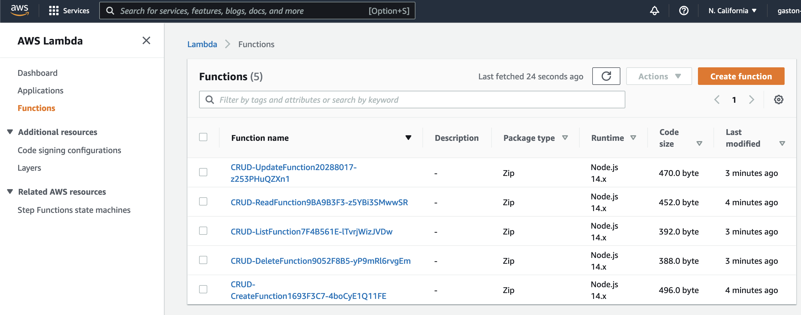

# iac-cdk-tutorial
Un breve tutorial acerca de la importancia de IAC y un ejemplo practico con aws-cdk.

## Porque IAC?
IAC significa Infrastructure As Code, e implica que nuestra infraestructura se encuentre codificada y bajo control de versiones y disminuir errores humanos.

### Que problemas resolvemos?
Lo que IAC resuelve es la disminucion de errores humanos en la creacion y modificacion de infra de manera manual, en la consola (UI) o por CLI. 

También permite replicar infraestructura de manera exacta entre 2 ambientes de desarrollo (ej: prod, staging, qa)

## Que es aws-cdk?

AWS-CDK es una SDK que permite crear infra en AWS usando lenguajes de codigo familiares como Python o JS. Esta herramienta mejora el manejo de referencias y permite el uso de if-statements y for-loops respecto de herramientas de IAC basadas en manifiestos YAML o JSON.

https://docs.aws.amazon.com/cdk/latest/guide/home.html

https://docs.aws.amazon.com/cdk/api/latest/docs/aws-construct-library.html

## Caso Practico:

Una de los problemas mas comunes en el desarrollo web es la implementacion de la funcionalidad CRUD de un tipo de dato.

Vamos a disponibilizar una API que implemente la funcionalidad CRUD de nuestros libros favoritos. Debemos obtener el siguiente diagrama, que vincule un API Gateway a los Lambda que ejecuten cada una de las funciones CRUD sobre la base de datos DynamoDB.

### Situación Inicial

Vamos a partir del siguiente diagrama ya implementado en el CDK, y lo vamos a extender juntos. Pueden probarlo en sus casas sin costo alguno, ya que utilizamos servicios serverless de AWS.

### Entorno de desarrollo

#### Requisitos previos:

1. Instalar [docker](https://www.docker.com/products/docker-desktop)
1. Crear una cuenta en [AWS](https://aws.amazon.com/)
1. Instalar [aws-cli](https://docs.aws.amazon.com/cli/latest/userguide/getting-started-install.html)
1. Configurar aws-cli  `aws configure` con tus credenciales

#### Construir la imagen con las dependencias
Esta imagen instala node.js, la ultima version de aws-cdk y las dependencias de python que necesitamos:

    docker compose build cdk

#### Probar el entorno

    docker compose run cdk --version

#### Sintetizar el template de cdk
Chequeamos que el template de CloudFormation compile:

    docker compose run cdk synth

#### Desplegar
Desplegamos nuestra solución a AWS

    docker compose run cdk deploy --all

#### Actividad en conjunto:
Vamos a probar la aplicacion en su estado inicial  (`POST '/'` y `GET '/{bookId}'`) y luego implementar y probar el metodo list (`GET '/'`) 

    Al codigo---->

#### Actividad para ustedes:
Implementar y probar los metodos update (`PUT '/{bookId}'`) y delete (`DELETE '/{bookId}'`)

    Ahora a codear ustedes---->

#### Algunas capturas de como debe quedar:

La Tabla:

Las funciones Lambda:

El api-gateway:

